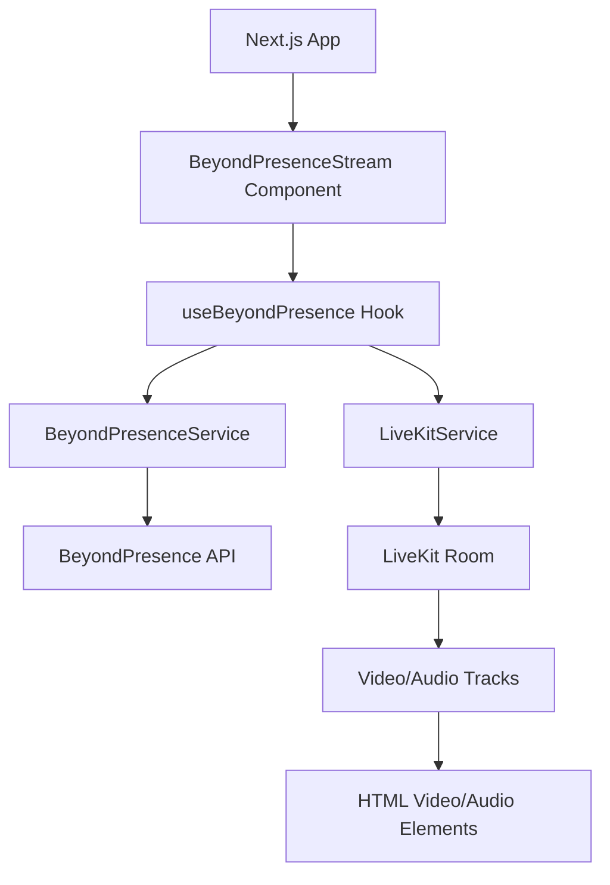
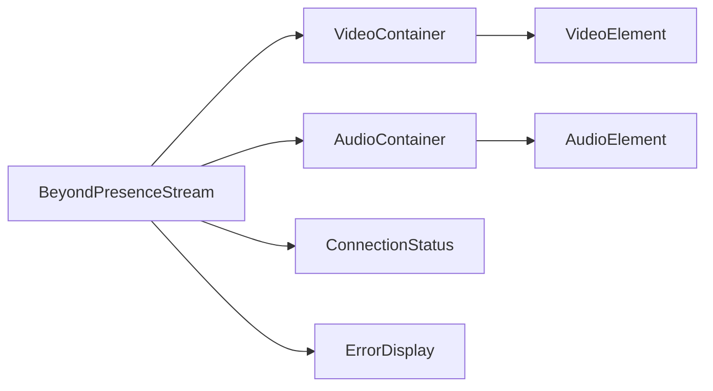

# Design Document

## Overview

This design outlines the integration of BeyondPresence avatar video streaming into a Next.js web application using the LiveKit JS Client SDK. The solution provides a React-based component architecture that handles BeyondPresence session management, LiveKit room connections, and automatic video/audio track rendering.

The integration follows a layered approach:
- **Service Layer**: Handles BeyondPresence API calls and LiveKit room management
- **Hook Layer**: Provides React hooks for state management and lifecycle handling  
- **Component Layer**: React components for video rendering and user interaction
- **Utility Layer**: Error handling, logging, and browser compatibility checks

## Architecture

### High-Level Architecture



### Component Architecture



## Components and Interfaces

### Core Service Classes

#### BeyondPresenceService
```typescript
interface BeyondPresenceConfig {
  apiKey: string;
  baseUrl?: string;
}

interface SessionConfig {
  avatarId: string;
  livekitToken: string;
  livekitUrl: string;
}

class BeyondPresenceService {
  constructor(config: BeyondPresenceConfig)
  createSession(config: SessionConfig): Promise<BeyondPresenceSession>
  getSession(sessionId: string): Promise<BeyondPresenceSession>
  destroySession(sessionId: string): Promise<void>
}
```

#### LiveKitService
```typescript
interface LiveKitConfig {
  url: string;
  token: string;
  roomOptions?: RoomOptions;
}

class LiveKitService {
  constructor()
  connect(config: LiveKitConfig): Promise<Room>
  disconnect(): Promise<void>
  getRoom(): Room | null
  isConnected(): boolean
}
```

### React Hook Interface

#### useBeyondPresence Hook
```typescript
interface UseBeyondPresenceConfig {
  beyondPresence: BeyondPresenceConfig;
  session: SessionConfig;
  autoConnect?: boolean;
  onError?: (error: Error) => void;
  onConnected?: () => void;
  onDisconnected?: () => void;
}

interface UseBeyondPresenceReturn {
  // Connection state
  isConnecting: boolean;
  isConnected: boolean;
  error: Error | null;
  
  // Session data
  session: BeyondPresenceSession | null;
  room: Room | null;
  
  // Track management
  videoTracks: RemoteVideoTrack[];
  audioTracks: RemoteAudioTrack[];
  
  // Control methods
  connect: () => Promise<void>;
  disconnect: () => Promise<void>;
  startAudio: () => Promise<void>;
  
  // Audio state
  canPlayAudio: boolean;
  audioPlaybackBlocked: boolean;
}
```

### React Component Interfaces

#### BeyondPresenceStream Component
```typescript
interface BeyondPresenceStreamProps {
  config: UseBeyondPresenceConfig;
  className?: string;
  videoClassName?: string;
  audioClassName?: string;
  showConnectionStatus?: boolean;
  showErrorDisplay?: boolean;
  onVideoTrackAttached?: (element: HTMLVideoElement, track: RemoteVideoTrack) => void;
  onAudioTrackAttached?: (element: HTMLAudioElement, track: RemoteAudioTrack) => void;
}
```

## Data Models

### BeyondPresence Session Model
```typescript
interface BeyondPresenceSession {
  id: string;
  avatarId: string;
  livekitToken: string;
  livekitUrl: string;
  status: 'active' | 'inactive' | 'expired';
  createdAt: string;
  expiresAt: string;
}
```

### Connection State Model
```typescript
interface ConnectionState {
  status: 'disconnected' | 'connecting' | 'connected' | 'reconnecting' | 'failed';
  error: Error | null;
  lastConnectedAt: Date | null;
  reconnectAttempts: number;
}
```

### Track State Model
```typescript
interface TrackState {
  videoTracks: Map<string, RemoteVideoTrack>;
  audioTracks: Map<string, RemoteAudioTrack>;
  attachedElements: Map<string, HTMLElement>;
}
```

## Error Handling

### Error Types
```typescript
enum BeyondPresenceErrorType {
  AUTHENTICATION_ERROR = 'AUTHENTICATION_ERROR',
  SESSION_CREATION_ERROR = 'SESSION_CREATION_ERROR',
  SESSION_EXPIRED_ERROR = 'SESSION_EXPIRED_ERROR',
  LIVEKIT_CONNECTION_ERROR = 'LIVEKIT_CONNECTION_ERROR',
  TRACK_SUBSCRIPTION_ERROR = 'TRACK_SUBSCRIPTION_ERROR',
  AUDIO_PLAYBACK_ERROR = 'AUDIO_PLAYBACK_ERROR',
  BROWSER_COMPATIBILITY_ERROR = 'BROWSER_COMPATIBILITY_ERROR'
}

class BeyondPresenceError extends Error {
  constructor(
    public type: BeyondPresenceErrorType,
    message: string,
    public originalError?: Error
  )
}
```

### Error Recovery Strategies

1. **Session Expiration**: Automatically refresh session when expired
2. **Connection Drops**: Exponential backoff reconnection (2s, 4s, 8s, max 30s)
3. **Track Failures**: Retry track subscription up to 3 times
4. **Audio Playback**: Provide user interaction prompts for browser restrictions

### Logging Strategy
```typescript
interface Logger {
  debug(message: string, context?: object): void;
  info(message: string, context?: object): void;
  warn(message: string, context?: object): void;
  error(message: string, error?: Error, context?: object): void;
}

enum LogLevel {
  DEBUG = 0,
  INFO = 1,
  WARN = 2,
  ERROR = 3,
  OFF = 4
}
```

## Testing Strategy

### Unit Testing
- **Service Classes**: Mock API calls and test error handling
- **React Hooks**: Test state transitions and side effects using React Testing Library
- **Utility Functions**: Test browser compatibility checks and error parsing

### Integration Testing
- **Component Integration**: Test full component rendering with mock services
- **API Integration**: Test actual BeyondPresence API calls in controlled environment
- **LiveKit Integration**: Test room connection and track handling

### End-to-End Testing
- **Full Flow Testing**: Test complete user journey from session creation to video display
- **Error Scenarios**: Test network failures, session expiration, and browser restrictions
- **Cross-Browser Testing**: Verify compatibility across Chrome, Firefox, Safari, Edge

### Test Structure
```
src/
├── services/
│   ├── __tests__/
│   │   ├── BeyondPresenceService.test.ts
│   │   └── LiveKitService.test.ts
├── hooks/
│   ├── __tests__/
│   │   └── useBeyondPresence.test.ts
├── components/
│   ├── __tests__/
│   │   └── BeyondPresenceStream.test.tsx
└── utils/
    ├── __tests__/
    │   ├── errorHandling.test.ts
    │   └── browserCompat.test.ts
```

## Implementation Architecture

### File Structure
```
src/
├── lib/
│   └── beyondpresence/
│       ├── services/
│       │   ├── BeyondPresenceService.ts
│       │   └── LiveKitService.ts
│       ├── hooks/
│       │   └── useBeyondPresence.ts
│       ├── components/
│       │   ├── BeyondPresenceStream.tsx
│       │   ├── VideoContainer.tsx
│       │   ├── AudioContainer.tsx
│       │   └── ConnectionStatus.tsx
│       ├── utils/
│       │   ├── errorHandling.ts
│       │   ├── browserCompat.ts
│       │   └── logger.ts
│       └── types/
│           └── index.ts
├── app/
│   ├── page.tsx (demo implementation)
│   └── globals.css
└── components/
    └── ui/ (shared UI components)
```

### Dependencies to Add
```json
{
  "dependencies": {
    "@bey-dev/sdk": "^0.0.1",
    "livekit-client": "^2.15.6"
  },
  "devDependencies": {
    "@testing-library/react": "^14.0.0",
    "@testing-library/jest-dom": "^6.0.0",
    "jest": "^29.0.0",
    "jest-environment-jsdom": "^29.0.0"
  }
}
```

### Environment Variables
```env
# BeyondPresence Configuration
BEY_API_KEY=your_api_key_here
BEY_BASE_URL=https://api.bey.dev

# Demo Configuration (for development)
NEXT_PUBLIC_DEMO_AVATAR_ID=01234567-89ab-cdef-0123-456789abcdef
NEXT_PUBLIC_DEMO_LIVEKIT_URL=wss://your-domain.livekit.cloud
NEXT_PUBLIC_DEMO_LIVEKIT_TOKEN=your_demo_token
```

## Browser Compatibility

### Supported Browsers
- Chrome 88+ (full support)
- Firefox 85+ (full support)  
- Safari 14+ (full support)
- Edge 88+ (full support)

### Feature Detection
```typescript
interface BrowserCapabilities {
  webRTC: boolean;
  mediaDevices: boolean;
  insertableStreams: boolean;
  adaptiveStream: boolean;
  dynacast: boolean;
}

function detectBrowserCapabilities(): BrowserCapabilities
```

### Graceful Degradation
- Disable adaptive streaming on older browsers
- Fallback to basic video rendering without advanced features
- Provide clear error messages for unsupported browsers

## Performance Considerations

### Optimization Strategies
1. **Lazy Loading**: Load BeyondPresence SDK only when needed
2. **Connection Pooling**: Reuse LiveKit connections when possible
3. **Track Management**: Efficiently subscribe/unsubscribe from tracks
4. **Memory Management**: Proper cleanup of video/audio elements

### Resource Management
- Automatic cleanup on component unmount
- Track detachment when components are destroyed
- Connection cleanup on page navigation
- Memory leak prevention for long-running sessions